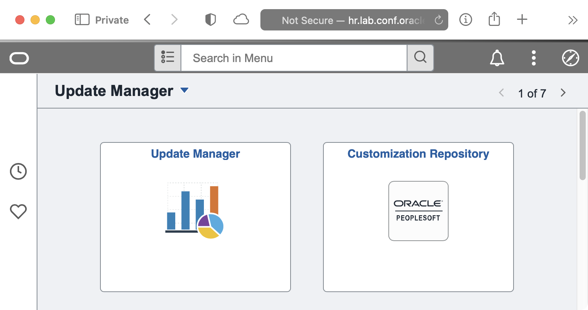

# psadmin.io 8.59 Themes

We are releasing our newest version of our Themes for PeopleSoft 8.59 (and 8.58). We use these stylesheets on our non-production environments so that users can easily recognize which environment they are in, and most important, know they aren't in production.

The Themes are released as an Application Data Set that you can easiliy import into your applications. The ADS project includes stylesheets and Branding Themes.

## Importing Themes

Under the Releases, you can [download the lastest `IO_STYLE_859.zip`]() release. Unpack the zip file to your Data Migration File Location.

You use the Data Migration Workbench's "Load Project From File" feature to import the themes and the stylesheets.

## Assigning Themes

To set the main theme for your system, 

1. Navigate to `PeopleTools > Portal > Branding > Branding System Options`
1. Select the `IO_` theme of your choice.
1. You will also need to add a stylesheet for Classic Plus. Add the cooresponding `IO_<color>_859_PTCP_SS` as an additional stylesheet.


4. If you have set Theme Assignments, you can update those as well under `PeopleTools > Portal > Branding > Assign Branding Themes`

## SQL for Refreshes

Typically, the `IO_STYLE_859` is load into production but not used. During your refresh, you can use the following SQL to configure your new environment to use a theme. 

```sql
UPDATE sysadm.psoptions
SET
    ptbrandtheme = 'IO_GREEN_859_THEME',
    themestyletype = 'PTCP';

TRUNCATE TABLE sysadm.psoptionsaddl;

INSERT INTO sysadm.psoptionsaddl 
VALUES (
    'C',
    'CSS',
    'IO_GREEN_859_PTCP_SS',
    0
);
```

## Colors

> I used https://colordesigner.io/ to help build the color schemes.

### Orange

| Primary | Dark    | Light    | Accent  |
| ------- | ------- | -------- | ------- |
| #FF8100 | #FF5100 | #FFAA00  | #004757 |


### Red

| Primary | Dark    | Light    | Accent  |
| ------- | ------- | -------- | ------- |
| #94090D | #5C0002 | #D40D12  | #1dfff9 |


### Green

| Primary | Dark    | Light    | Accent  |
| ------- | ------- | -------- | ------- |
| #097609 | #075807 | #70AF1A  | #591aaf |


### Purple

| Primary | Dark    | Light    | Accent  |
| ------- | ------- | -------- | ------- |
| #553285 | #36175E | #9768D1  | #a2d168 |


### Blue

| Primary | Dark    | Light    | Accent  |
| ------- | ------- | -------- | ------- |
| #0074D9 | #00448D | #7ABAF2  | #f2b27a |


### Teal

| Primary | Dark    | Light    | Accent  |
| ------- | ------- | -------- | ------- |
| #009798 | #227273 | #9DF3F4  | #f49e9d |


### Yellow

| Primary | Dark    | Light    | Accent  |
| ------- | ------- | -------- | ------- |
| #CCCC04 | #8d8d03 | #FFFF52  | #5252ff |


### Brown

| Primary | Dark    | Light    | Accent  |
| ------- | ------- | -------- | ------- |
| #A36F44 | #6B4732 | #F7DEB2  | #b2cbf7 |


### Pink

| Primary | Dark    | Light    | Accent  |
| ------- | ------- | -------- | ------- |
| #AA3366 | #552233 | #CC5599  | #55cc88 |


### Grey

| Primary | Dark    | Light    | Accent  |
| ------- | ------- | -------- | ------- |
| #707070 | #3B3B3B | #BABABA  | #FD7400 |


