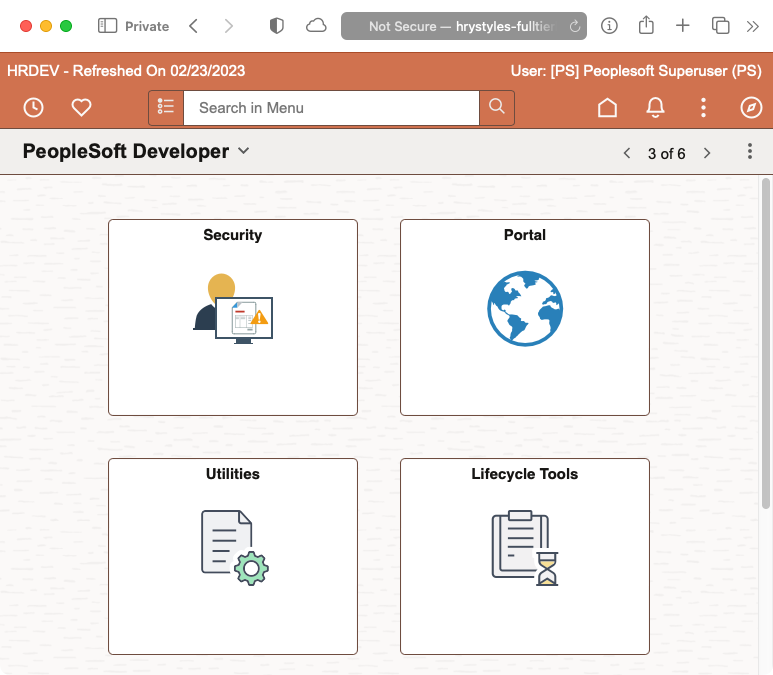
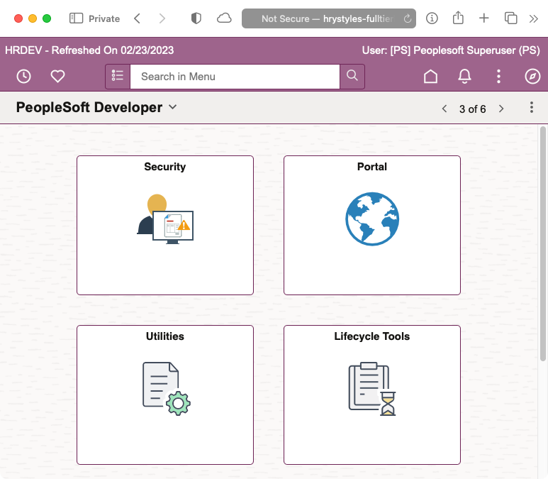
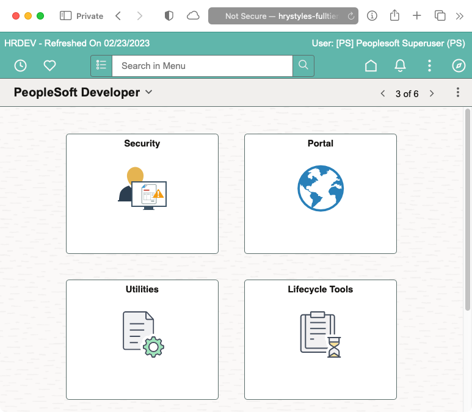
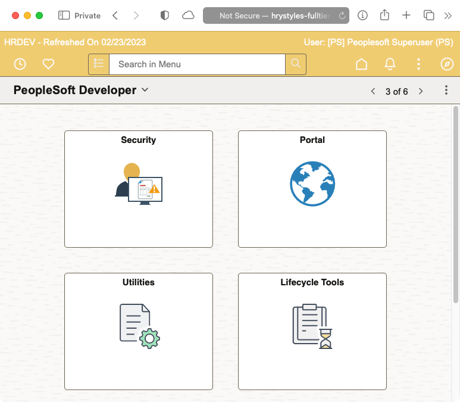
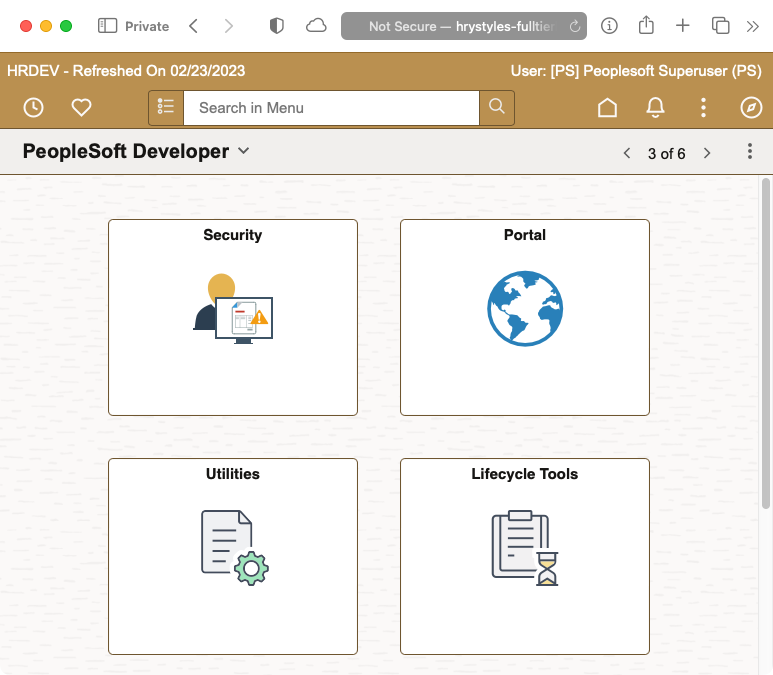
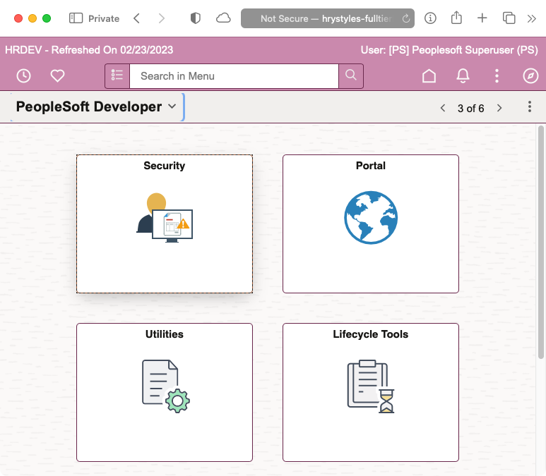

# psadmin.io Themes

We are releasing our newest version of our Themes for PeopleSoft 8.60, 8.59 and 8.58. We use these stylesheets on our non-production environments so that users can easily recognize which environment they are in, and most important, know they aren't in production.

The Themes are released as an Application Data Set that you can easiliy import into your applications. The ADS project includes stylesheets and Branding Themes.

## Importing Themes

### PeopleTools 8.60 

For 8.60, under the Releases link on the right, you can download the latest `IO_STYLE_REDWOOD.zip`]() release. Unpack the zip file to your Data Migration File Location.

You use the Data Migration Workbench's "Load Project From File" feature to import the themes and the stylesheets.

### PeopleTools 8.58/8.59

For 8.58 and 8.58, under the Releases link on the right, you can [download the lastest `IO_STYLE_859.zip`](https://github.com/psadmin-io/io-styles-859/releases/download/v1.1/IO_STYLES_859-v1.1.zip) release. Unpack the zip file to your Data Migration File Location.

You use the Data Migration Workbench's "Load Project From File" feature to import the themes and the stylesheets.

## Assigning Themes

To set the main theme for your system, 

1. Navigate to `PeopleTools > Portal > Branding > Branding System Options`
1. Select the `IO_` theme of your choice.
2. You will also need to add a stylesheet for Classic Plus. Add the cooresponding `IO_<color>_860_PTCP_SS`  or `IO_<color>_859_PTCP_SS` as an additional stylesheet.


4. If you have set Theme Assignments, you can update those as well under `PeopleTools > Portal > Branding > Assign Branding Themes`

## SQL for Refreshes

Typically, the `IO_STYLE_859` or `IO_STYLE_REDWOOD` project is loaded into production but not used. During your refresh, you can use the following SQL to configure your new environment to use a theme. 

```sql
UPDATE sysadm.psoptions
SET
    ptbrandtheme = 'IO_GREEN_RW_THEME',
    themestyletype = 'PTCP';

TRUNCATE TABLE sysadm.psoptionsaddl;

INSERT INTO sysadm.psoptionsaddl 
VALUES (
    'C',
    'CSS',
    'IO_GREEN_860_PTCP_SS',
    0
);
```

## CompanyInfo Banner

If you want to use the CompanyInfo banner element, you can enable the HTML object with this SQL and populate the database name, refresh date, and the currently logged in user.

```sql
UPDATE sysadm.ps_ptbr_lteltat
SET
    ptbr_attr_eb_cla = 'Y'
WHERE
        ptbr_layout_id = 'DEFAULT_HEADER_FLUID'
    AND ptbr_element_id = 'CompanyInfo'
    AND ptbr_attr_id = '.html';

truncate table sysadm.ps_ptbr_ltattr_cla;

INSERT INTO sysadm.ps_ptbr_ltattr_cla (
    ptbr_attr_eb_cla,
    ptbr_layout_id,
    ptbr_attr_lval_cla
) VALUES (
    'Y',
    'DEFAULT_HEADER_FLUID',
    '<div style="width: 100%; height: 17px; padding-top: 3px; padding-bottom: 3px;"><div id="ioDBName">:1 - Refreshed On :2</div><div id="ioWelcome">:3</div></div>'
);
```

You must also customize the `PTBR_BRANDING.UTILITY.GetCompanyInfoHtml.OnExecute` class so that it will resolve the parameters in the HTML above.

```peoplecode

method GetFluidBannerHtml
   /* Delivered method here... */

   /* IO_STYLE_859 Customization - Start */
   Local string &dbName;
   SQLExec("select LONGNAME from %Table(:1)", Record.PSOPTIONS, &dbName);
   &BannerHtml = Substitute(&BannerHtml, ":1", &dbName);
   
   Local date &refreshDate;
   SQLExec("select %DateOut(LASTREFRESHDTTM) from %Table(:1)", Record.PSSTATUS, &refreshDate);
   &BannerHtml = Substitute(&BannerHtml, ":2", DateTimeToLocalizedString(&refreshDate, "MM/dd/yyyy"));
   
   Local string &firstName;
   SQLExec("select OPRDEFNDESC from %Table(:1) where OPRID = :2", Record.PSOPRDEFN, %OperatorId, &firstName);
   If All(&firstName) Then
      &BannerHtml = Substitute(&BannerHtml, ":3", "User: " | &firstName | " (" | %OperatorId | ")&nbsp;");
   Else
      &BannerHtml = Substitute(&BannerHtml, ":3", "User: " | %OperatorId | "&nbsp;");
   End-If;
   /* IO_STYLE_859 Customization - End */

   Return &BannerHtml;
   
end-method;
```

For Classic pages, add this PeopleCode to `PTBR_BRANDING.Elements.CompanyInfoConfigurator.OnExecute`.

```peoplecode
method getHTML
   /* Delivered method here... */

   /* IO_STYLE_859 Customization - Start */
   Local string &dbName;
   SQLExec("select LONGNAME from %Table(:1)", Record.PSOPTIONS, &dbName);
   &getHTML = Substitute(&getHTML, ":1", &dbName);
   
   Local date &refreshDate;
   SQLExec("select %DateOut(LASTREFRESHDTTM) from %Table(:1)", Record.PSSTATUS, &refreshDate);
   &getHTML = Substitute(&getHTML, ":2", DateTimeToLocalizedString(&refreshDate, "MM/dd/yyyy"));
   
   Local string &firstName;
   SQLExec("select OPRDEFNDESC from %Table(:1) where OPRID = :2", Record.PSOPRDEFN, %OperatorId, &firstName);
   If All(&firstName) Then
      &getHTML = Substitute(&getHTML, ":3", "User: " | &firstName | " (" | %OperatorId | ")&nbsp;");
   Else
      &getHTML = Substitute(&getHTML, ":3", "User: " | %OperatorId | "&nbsp;");
   End-If;
   /* IO_STYLE_859 Customization - End */

   Return &getHTML;
end-method;
```

## 8.60 Colors (Redwood Themes)

### Orange

| Primary | Accent  |
| ------- | ------  |
| #d0724f | #6E4E48 |



### Red

| Primary | Accent  |
| ------- | ------  |
| #D63B25 | #6E3A34 |


### Green

| Primary | Accent  |
| ------- | ------  |
| #84AD6A | #577346 |


### Purple

| Primary | Accent  |
| ------- | ------  |
| #9e648c | #6E2456 |



### Blue

| Primary | Accent  |
| ------- | ------  |
| #1374BA | #2C526E |


### Teal

| Primary | Accent  |
| ------- | ------  |
| #60b6ab | #5B6E6B |



### Yellow

| Primary | Accent  |
| ------- | ------  |
| #F0CC71 | #6E6754 |



### Brown

| Primary | Accent  |
| ------- | ------  |
| #BA9050 | #6E552F |



### Pink

| Primary | Accent  |
| ------- | ------  |
| #ca89ad | #6B294D |



### Grey

| Primary | Accent  |
| ------- | ------  |
| #C9C3BD | #9E9995 |


## 8.58/8.59 Colors

### Orange

| Primary | Dark    | Light    | Accent  |
| ------- | ------- | -------- | ------- |
| #FF8100 | #FF5100 | #FFAA00  | #004757 |


### Red

| Primary | Dark    | Light    | Accent  |
| ------- | ------- | -------- | ------- |
| #94090D | #5C0002 | #D40D12  | #1dfff9 |


### Green

| Primary | Dark    | Light    | Accent  |
| ------- | ------- | -------- | ------- |
| #097609 | #075807 | #70AF1A  | #591aaf |


### Purple

| Primary | Dark    | Light    | Accent  |
| ------- | ------- | -------- | ------- |
| #553285 | #36175E | #9768D1  | #a2d168 |


### Blue

| Primary | Dark    | Light    | Accent  |
| ------- | ------- | -------- | ------- |
| #0074D9 | #00448D | #7ABAF2  | #f2b27a |


### Teal

| Primary | Dark    | Light    | Accent  |
| ------- | ------- | -------- | ------- |
| #009798 | #227273 | #9DF3F4  | #f49e9d |


### Yellow

| Primary | Dark    | Light    | Accent  |
| ------- | ------- | -------- | ------- |
| #CCCC04 | #8d8d03 | #FFFF52  | #5252ff |


### Brown

| Primary | Dark    | Light    | Accent  |
| ------- | ------- | -------- | ------- |
| #A36F44 | #6B4732 | #F7DEB2  | #b2cbf7 |


### Pink

| Primary | Dark    | Light    | Accent  |
| ------- | ------- | -------- | ------- |
| #AA3366 | #552233 | #CC5599  | #55cc88 |


### Grey

| Primary | Dark    | Light    | Accent  |
| ------- | ------- | -------- | ------- |
| #707070 | #3B3B3B | #BABABA  | #FD7400 |


