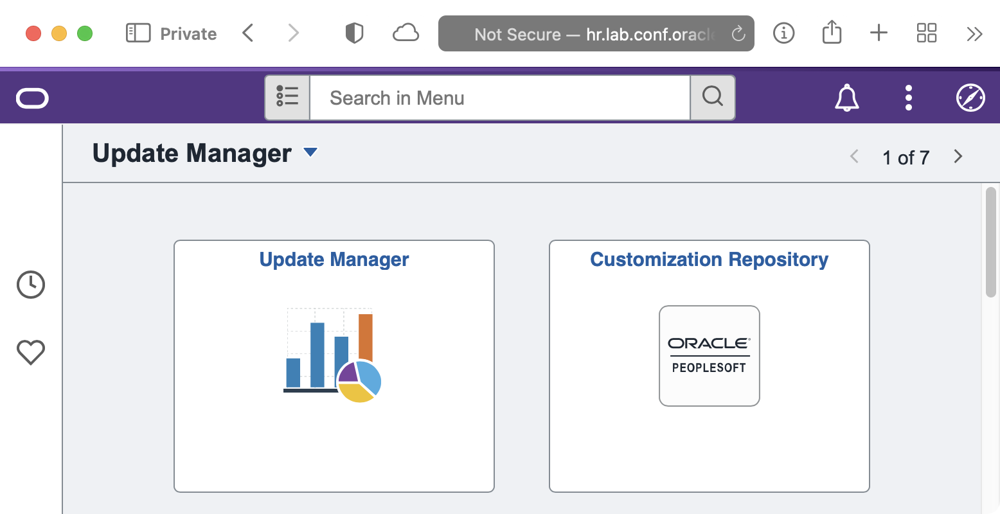
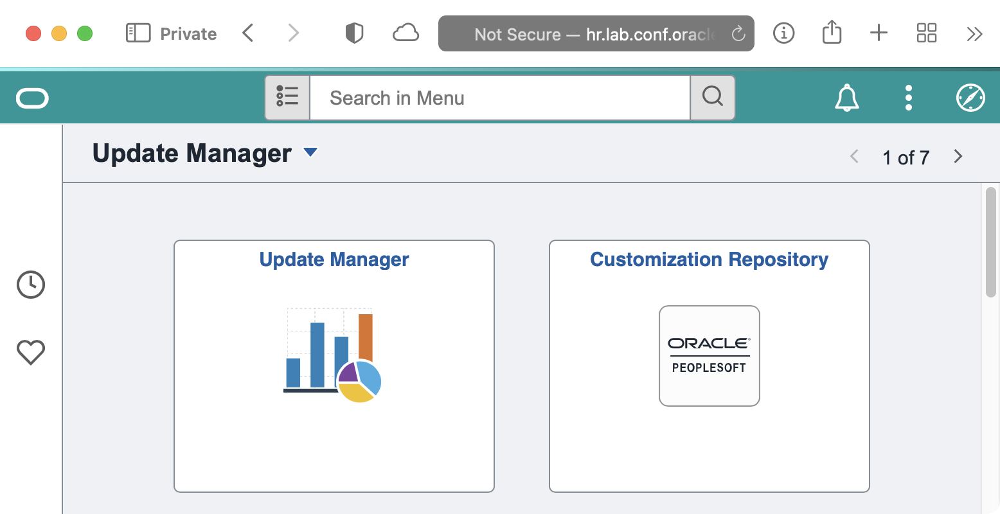

# psadmin.io 8.59 Themes

We are releasing our newest version of our Themes for PeopleSoft 8.59 (and 8.58). We use these stylesheets on our non-production environments so that users can easily recognize which environment they are in, and most important, know they aren't in production.

The Themes are released as an Application Data Set that you can easiliy import into your applications. The ADS project includes stylesheets and Branding Themes.

## Importing

Download the new themes from the Github respository here. You will find a 

## Assigning Themes

To set the main theme for your system, 

1. Navigate to `PeopleTools > Portal > Branding > Branding System Options`
1. Select the `IO_` theme of your choice.
1. You will also need to add a stylesheet for Classic Plus. Add the cooresponding `IO_<color>_859_PTCP_SS` as an additional stylesheet.


## Orange


| Primary | Dark    | Light    | Accent  |
| ------- | ------- | -------- | ------- |
| #FF8100 | #FF5100 | #FFAA00  | #004757 |


## Red


| Primary | Dark    | Light    | Accent  |
| ------- | ------- | -------- | ------- |
| #94090D | #5C0002 | #D40D12  | #1dfff9 |

## Green


| Primary | Dark    | Light    | Accent  |
| ------- | ------- | -------- | ------- |
| #097609 | #075807 | #70AF1A  | #591aaf |

## Purple



| Primary | Dark    | Light    | Accent  |
| ------- | ------- | -------- | ------- |
| #553285 | #36175E | #9768D1  | #a2d168 |

## Blue


| Primary | Dark    | Light    | Accent  |
| ------- | ------- | -------- | ------- |
| #0074D9 | #00448D | #7ABAF2  | #f2b27a |

## Teal



| Primary | Dark    | Light    | Accent  |
| ------- | ------- | -------- | ------- |
| #009798 | #227273 | #9DF3F4  | #f49e9d |

## Yellow


| Primary | Dark    | Light    | Accent  |
| ------- | ------- | -------- | ------- |
| #CCCC04 | #8d8d03 | #FFFF52  | #5252ff |

## Brown


| Primary | Dark    | Light    | Accent  |
| ------- | ------- | -------- | ------- |
| #A36F44 | #6B4732 | #F7DEB2  | #b2cbf7 |

## Pink


| Primary | Dark    | Light    | Accent  |
| ------- | ------- | -------- | ------- |
| #AA3366 | #552233 | #CC5599  | #55cc88 |


**IO_ORANGE_859_FLUID_SS**

```css
/* Colorbar */
:root:not(.psc_mode-hc) .ps_header_bar-container:before {
  background: linear-gradient(to right, #FFAA00 0%, #FF5100 100%);
}

/* Banner */
.ps_header-banner, .ps_header_bar {
  background: #FF8100;
}

#PT_WORK_PT_BUTTON_BACK .ps_box-button.ps_button_backnav .ps-button, .ps_box-button.ps_button_backnav .ps-button:link {
  border-color: #FFF;
}

/* JSMPros - https://www.youtube.com/watch?v=FuHJTVgw5fU */
/* Fluid Notifications */
#PT_HEADER .psc_confirmation-animate {
  margin-right: .5em;
  left: auto;
  width: 350px;
  margin-top: .5em;
}

#PT_HEADER .psc_confirmation-area {
  border-radius: 5px;
}
```

**IO_ORANGE_859_PTCP_SS**

```css
/* Colorbar */
.ptprtlcontainer #ptbr_header_container::before  {
  background: linear-gradient(to right, #FFAA00 0%, #FF5100 100%);
}

/* Banner */
#ptbr_header_container #pthdr2container#pthdr2container.pthdr2container {
  background: #FF8100;
}

#classicbackbuttoncontainer.ps_box-button .ps-button-wrapper #PT_WORK_PT_BUTTON_BACK.ps-button {
  border-color: #fff;
}

/* JSMPros - https://www.youtube.com/watch?v=ExiMhUcdsFE */
/* Classic Plus Notifications */
.pt_classic_plus .ps_box-toolshiddens .PTCPSAVEDIV {
    width: 350px;
    border-radius: .5em;

    /* to fix overflow text issue */
    height:auto;

    /* to make space for the close button */
    padding: .1em 2em 1em 1em;
    text-align: left;
}

/* Classic Plus Notification Close Buttons */
.pt_classic_plus .ps_box-toolshiddens .PTCPSAVEDIV #ptpopupclose {
    float:right;
    position: absolute;
    top: .2em;
    right: -.2em;
}
```

**IO_RED_859_FLUID_SS**

```css
/* Colorbar */
:root:not(.psc_mode-hc) .ps_header_bar-container:before {
  background: linear-gradient(to right, #D40D12 0%, #5C0002 100%);
}

/* Banner */
.ps_header-banner, .ps_header_bar {
  background: #94090D;
}

#PT_WORK_PT_BUTTON_BACK .ps_box-button.ps_button_backnav .ps-button, .ps_box-button.ps_button_backnav .ps-button:link {
  border-color: #FFF;
}

/* JSMPros - https://www.youtube.com/watch?v=FuHJTVgw5fU */
/* Fluid Notifications */
#PT_HEADER .psc_confirmation-animate {
  margin-right: .5em;
  left: auto;
  width: 350px;
  margin-top: .5em;
}

#PT_HEADER .psc_confirmation-area {
  border-radius: 5px;
}
```

**IO_RED_859_PTCP_SS**

```css
/* Colorbar */
.ptprtlcontainer #ptbr_header_container::before  {
  background: linear-gradient(to right, #D40D12 0%, #5C0002 100%);
}

/* Banner */
#ptbr_header_container #pthdr2container#pthdr2container.pthdr2container {
  background: #94090D;
}

#classicbackbuttoncontainer.ps_box-button .ps-button-wrapper #PT_WORK_PT_BUTTON_BACK.ps-button {
  border-color: #fff;
}

/* JSMPros - https://www.youtube.com/watch?v=ExiMhUcdsFE */
/* Classic Plus Notifications */
.pt_classic_plus .ps_box-toolshiddens .PTCPSAVEDIV {
    width: 350px;
    border-radius: .5em;

    /* to fix overflow text issue */
    height:auto;

    /* to make space for the close button */
    padding: .1em 2em 1em 1em;
    text-align: left;
}

/* Classic Plus Notification Close Buttons */
.pt_classic_plus .ps_box-toolshiddens .PTCPSAVEDIV #ptpopupclose {
    float:right;
    position: absolute;
    top: .2em;
    right: -.2em;
}
```

**IO_GREEN_859_FLUID_SS**

```css
/* Colorbar */
:root:not(.psc_mode-hc) .ps_header_bar-container:before {
  background: linear-gradient(to right, #70AF1A 0%, #075807 100%);
}

/* Banner */
.ps_header-banner, .ps_header_bar {
  background: #097609;
}

#PT_WORK_PT_BUTTON_BACK .ps_box-button.ps_button_backnav .ps-button, .ps_box-button.ps_button_backnav .ps-button:link {
  border-color: #FFF;
}

/* JSMPros - https://www.youtube.com/watch?v=FuHJTVgw5fU */
/* Fluid Notifications */
#PT_HEADER .psc_confirmation-animate {
  margin-right: .5em;
  left: auto;
  width: 350px;
  margin-top: .5em;
}

#PT_HEADER .psc_confirmation-area {
  border-radius: 5px;
}
```

**IO_GREEN_859_PTCP_SS**

```css
/* Colorbar */
.ptprtlcontainer #ptbr_header_container::before  {
  background: linear-gradient(to right, #70AF1A 0%, #075807 100%);
}

/* Banner */
#ptbr_header_container #pthdr2container#pthdr2container.pthdr2container {
  background: #097609;
}

#classicbackbuttoncontainer.ps_box-button .ps-button-wrapper #PT_WORK_PT_BUTTON_BACK.ps-button {
  border-color: #fff;
}

/* JSMPros - https://www.youtube.com/watch?v=ExiMhUcdsFE */
/* Classic Plus Notifications */
.pt_classic_plus .ps_box-toolshiddens .PTCPSAVEDIV {
    width: 350px;
    border-radius: .5em;

    /* to fix overflow text issue */
    height:auto;

    /* to make space for the close button */
    padding: .1em 2em 1em 1em;
    text-align: left;
}

/* Classic Plus Notification Close Buttons */
.pt_classic_plus .ps_box-toolshiddens .PTCPSAVEDIV #ptpopupclose {
    float:right;
    position: absolute;
    top: .2em;
    right: -.2em;
}
```

**IO_PINK_859_FLUID_SS**

```css
/* Colorbar */
:root:not(.psc_mode-hc) .ps_header_bar-container:before {
  background: linear-gradient(to right, #CC5599 0%, #552233 100%);
}

/* Banner */
.ps_header-banner, .ps_header_bar {
  background: #AA3366;
}

#PT_WORK_PT_BUTTON_BACK .ps_box-button.ps_button_backnav .ps-button, .ps_box-button.ps_button_backnav .ps-button:link {
  border-color: #FFF;
}

/* JSMPros - https://www.youtube.com/watch?v=FuHJTVgw5fU */
/* Fluid Notifications */
#PT_HEADER .psc_confirmation-animate {
  margin-right: .5em;
  left: auto;
  width: 350px;
  margin-top: .5em;
}

#PT_HEADER .psc_confirmation-area {
  border-radius: 5px;
}
```

**IO_PINK_859_PTCP_SS**

```css
/* Colorbar */
.ptprtlcontainer #ptbr_header_container::before  {
  background: linear-gradient(to right, #CC5599 0%, #552233 100%);
}

/* Banner */
#ptbr_header_container #pthdr2container#pthdr2container.pthdr2container {
  background: #AA3366;
}

#classicbackbuttoncontainer.ps_box-button .ps-button-wrapper #PT_WORK_PT_BUTTON_BACK.ps-button {
  border-color: #fff;
}

/* JSMPros - https://www.youtube.com/watch?v=ExiMhUcdsFE */
/* Classic Plus Notifications */
.pt_classic_plus .ps_box-toolshiddens .PTCPSAVEDIV {
    width: 350px;
    border-radius: .5em;

    /* to fix overflow text issue */
    height:auto;

    /* to make space for the close button */
    padding: .1em 2em 1em 1em;
    text-align: left;
}

/* Classic Plus Notification Close Buttons */
.pt_classic_plus .ps_box-toolshiddens .PTCPSAVEDIV #ptpopupclose {
    float:right;
    position: absolute;
    top: .2em;
    right: -.2em;
}
```

**IO_PURPLE_859_FLUID_SS**

```css
/* Colorbar */
:root:not(.psc_mode-hc) .ps_header_bar-container:before {
  background: linear-gradient(to right, #9768D1 0%, #36175E 100%);
}

/* Banner */
.ps_header-banner, .ps_header_bar {
  background: #553285;
}

#PT_WORK_PT_BUTTON_BACK .ps_box-button.ps_button_backnav .ps-button, .ps_box-button.ps_button_backnav .ps-button:link {
  border-color: #FFF;
}

/* JSMPros - https://www.youtube.com/watch?v=FuHJTVgw5fU */
/* Fluid Notifications */
#PT_HEADER .psc_confirmation-animate {
  margin-right: .5em;
  left: auto;
  width: 350px;
  margin-top: .5em;
}

#PT_HEADER .psc_confirmation-area {
  border-radius: 5px;
}
```

**IO_PURPLE_859_PTCP_SS**

```css
/* Colorbar */
.ptprtlcontainer #ptbr_header_container::before  {
  background: linear-gradient(to right, #9768D1 0%, #36175E 100%);
}

/* Banner */
#ptbr_header_container #pthdr2container#pthdr2container.pthdr2container {
  background: #553285;
}

#classicbackbuttoncontainer.ps_box-button .ps-button-wrapper #PT_WORK_PT_BUTTON_BACK.ps-button {
  border-color: #fff;
}

/* JSMPros - https://www.youtube.com/watch?v=ExiMhUcdsFE */
/* Classic Plus Notifications */
.pt_classic_plus .ps_box-toolshiddens .PTCPSAVEDIV {
    width: 350px;
    border-radius: .5em;

    /* to fix overflow text issue */
    height:auto;

    /* to make space for the close button */
    padding: .1em 2em 1em 1em;
    text-align: left;
}

/* Classic Plus Notification Close Buttons */
.pt_classic_plus .ps_box-toolshiddens .PTCPSAVEDIV #ptpopupclose {
    float:right;
    position: absolute;
    top: .2em;
    right: -.2em;
}
```

**IO_BLUE_859_FLUID_SS**

```css
/* Colorbar */
:root:not(.psc_mode-hc) .ps_header_bar-container:before {
  background: linear-gradient(to right, #7ABAF2 0%, #00448D 100%);
}

/* Banner */
.ps_header-banner, .ps_header_bar {
  background: #0074D9;
}

#PT_WORK_PT_BUTTON_BACK .ps_box-button.ps_button_backnav .ps-button, .ps_box-button.ps_button_backnav .ps-button:link {
  border-color: #FFF;
}

/* JSMPros - https://www.youtube.com/watch?v=FuHJTVgw5fU */
/* Fluid Notifications */
#PT_HEADER .psc_confirmation-animate {
  margin-right: .5em;
  left: auto;
  width: 350px;
  margin-top: .5em;
}

#PT_HEADER .psc_confirmation-area {
  border-radius: 5px;
}
```

**IO_BLUE_859_PTCP_SS**

```css
/* Colorbar */
.ptprtlcontainer #ptbr_header_container::before  {
  background: linear-gradient(to right, #7ABAF2 0%, #00448D 100%);
}

/* Banner */
#ptbr_header_container #pthdr2container#pthdr2container.pthdr2container {
  background: #0074D9;
}

#classicbackbuttoncontainer.ps_box-button .ps-button-wrapper #PT_WORK_PT_BUTTON_BACK.ps-button {
  border-color: #fff;
}

/* JSMPros - https://www.youtube.com/watch?v=ExiMhUcdsFE */
/* Classic Plus Notifications */
.pt_classic_plus .ps_box-toolshiddens .PTCPSAVEDIV {
    width: 350px;
    border-radius: .5em;

    /* to fix overflow text issue */
    height:auto;

    /* to make space for the close button */
    padding: .1em 2em 1em 1em;
    text-align: left;
}

/* Classic Plus Notification Close Buttons */
.pt_classic_plus .ps_box-toolshiddens .PTCPSAVEDIV #ptpopupclose {
    float:right;
    position: absolute;
    top: .2em;
    right: -.2em;
}
```

**IO_TEAL_859_FLUID_SS**

```css
/* Colorbar */
:root:not(.psc_mode-hc) .ps_header_bar-container:before {
  background: linear-gradient(to right, #9DF3F4 0%, #227273 100%);
}

/* Banner */
.ps_header-banner, .ps_header_bar {
  background: #009798;
}

#PT_WORK_PT_BUTTON_BACK .ps_box-button.ps_button_backnav .ps-button, .ps_box-button.ps_button_backnav .ps-button:link {
  border-color: #FFF;
}

/* JSMPros - https://www.youtube.com/watch?v=FuHJTVgw5fU */
/* Fluid Notifications */
#PT_HEADER .psc_confirmation-animate {
  margin-right: .5em;
  left: auto;
  width: 350px;
  margin-top: .5em;
}

#PT_HEADER .psc_confirmation-area {
  border-radius: 5px;
}
```

**IO_TEAL_859_PTCP_SS**

```css
/* Colorbar */
.ptprtlcontainer #ptbr_header_container::before  {
  background: linear-gradient(to right, #9DF3F4 0%, #227273 100%);
}

/* Banner */
#ptbr_header_container #pthdr2container#pthdr2container.pthdr2container {
  background: #009798;
}

#classicbackbuttoncontainer.ps_box-button .ps-button-wrapper #PT_WORK_PT_BUTTON_BACK.ps-button {
  border-color: #fff;
}

/* JSMPros - https://www.youtube.com/watch?v=ExiMhUcdsFE */
/* Classic Plus Notifications */
.pt_classic_plus .ps_box-toolshiddens .PTCPSAVEDIV {
    width: 350px;
    border-radius: .5em;

    /* to fix overflow text issue */
    height:auto;

    /* to make space for the close button */
    padding: .1em 2em 1em 1em;
    text-align: left;
}

/* Classic Plus Notification Close Buttons */
.pt_classic_plus .ps_box-toolshiddens .PTCPSAVEDIV #ptpopupclose {
    float:right;
    position: absolute;
    top: .2em;
    right: -.2em;
}
```

**IO_YELLOW_859_FLUID_SS**

```css
/* Colorbar */
:root:not(.psc_mode-hc) .ps_header_bar-container:before {
  background: linear-gradient(to right, #FFFF52 0%, #8d8d03 100%);
}

/* Banner */
.ps_header-banner, .ps_header_bar {
  background: #CCCC04;
}

#PT_WORK_PT_BUTTON_BACK .ps_box-button.ps_button_backnav .ps-button, .ps_box-button.ps_button_backnav .ps-button:link {
  border-color: #FFF;
}

/* JSMPros - https://www.youtube.com/watch?v=FuHJTVgw5fU */
/* Fluid Notifications */
#PT_HEADER .psc_confirmation-animate {
  margin-right: .5em;
  left: auto;
  width: 350px;
  margin-top: .5em;
}

#PT_HEADER .psc_confirmation-area {
  border-radius: 5px;
}
```

**IO_YELLOW_859_PTCP_SS**

```css
/* Colorbar */
.ptprtlcontainer #ptbr_header_container::before  {
  background: linear-gradient(to right, #FFFF52 0%, #8d8d03 100%);
}

/* Banner */
#ptbr_header_container #pthdr2container#pthdr2container.pthdr2container {
  background: #CCCC04;
}

#classicbackbuttoncontainer.ps_box-button .ps-button-wrapper #PT_WORK_PT_BUTTON_BACK.ps-button {
  border-color: #fff;
}

/* JSMPros - https://www.youtube.com/watch?v=ExiMhUcdsFE */
/* Classic Plus Notifications */
.pt_classic_plus .ps_box-toolshiddens .PTCPSAVEDIV {
    width: 350px;
    border-radius: .5em;

    /* to fix overflow text issue */
    height:auto;

    /* to make space for the close button */
    padding: .1em 2em 1em 1em;
    text-align: left;
}

/* Classic Plus Notification Close Buttons */
.pt_classic_plus .ps_box-toolshiddens .PTCPSAVEDIV #ptpopupclose {
    float:right;
    position: absolute;
    top: .2em;
    right: -.2em;
}
```

**IO_BROWN_859_FLUID_SS**

```css
/* Colorbar */
:root:not(.psc_mode-hc) .ps_header_bar-container:before {
  background: linear-gradient(to right, #F7DEB2 0%, #6B4732 100%);
}

/* Banner */
.ps_header-banner, .ps_header_bar {
  background: #A36F44;
}

#PT_WORK_PT_BUTTON_BACK .ps_box-button.ps_button_backnav .ps-button, .ps_box-button.ps_button_backnav .ps-button:link {
  border-color: #FFF;
}

/* JSMPros - https://www.youtube.com/watch?v=FuHJTVgw5fU */
/* Fluid Notifications */
#PT_HEADER .psc_confirmation-animate {
  margin-right: .5em;
  left: auto;
  width: 350px;
  margin-top: .5em;
}

#PT_HEADER .psc_confirmation-area {
  border-radius: 5px;
}
```

**IO_BROWN_859_PTCP_SS**

```css
/* Colorbar */
.ptprtlcontainer #ptbr_header_container::before  {
  background: linear-gradient(to right, #F7DEB2 0%, #6B4732 100%);
}

/* Banner */
#ptbr_header_container #pthdr2container#pthdr2container.pthdr2container {
  background: #A36F44;
}

#classicbackbuttoncontainer.ps_box-button .ps-button-wrapper #PT_WORK_PT_BUTTON_BACK.ps-button {
  border-color: #fff;
}

/* JSMPros - https://www.youtube.com/watch?v=ExiMhUcdsFE */
/* Classic Plus Notifications */
.pt_classic_plus .ps_box-toolshiddens .PTCPSAVEDIV {
    width: 350px;
    border-radius: .5em;

    /* to fix overflow text issue */
    height:auto;

    /* to make space for the close button */
    padding: .1em 2em 1em 1em;
    text-align: left;
}

/* Classic Plus Notification Close Buttons */
.pt_classic_plus .ps_box-toolshiddens .PTCPSAVEDIV #ptpopupclose {
    float:right;
    position: absolute;
    top: .2em;
    right: -.2em;
}
```


**IO_GREY_859_FLUID_SS**

```css
/* Colorbar */
:root:not(.psc_mode-hc) .ps_header_bar-container:before {
  background: linear-gradient(to right, #BABABA 0%, #3B3B3B 100%);
}

/* Banner */
.ps_header-banner, .ps_header_bar {
  background: #707070;
}

#PT_WORK_PT_BUTTON_BACK .ps_box-button.ps_button_backnav .ps-button, .ps_box-button.ps_button_backnav .ps-button:link {
  border-color: #FFF;
}

/* JSMPros - https://www.youtube.com/watch?v=FuHJTVgw5fU */
/* Fluid Notifications */
#PT_HEADER .psc_confirmation-animate {
  margin-right: .5em;
  left: auto;
  width: 350px;
  margin-top: .5em;
}

#PT_HEADER .psc_confirmation-area {
  border-radius: 5px;
}
```

**IO_GREY_859_PTCP_SS**

```css
/* Colorbar */
.ptprtlcontainer #ptbr_header_container::before  {
  background: linear-gradient(to right, #BABABA 0%, #3B3B3B 100%);
}

/* Banner */
#ptbr_header_container #pthdr2container#pthdr2container.pthdr2container {
  background: #707070;
}

#classicbackbuttoncontainer.ps_box-button .ps-button-wrapper #PT_WORK_PT_BUTTON_BACK.ps-button {
  border-color: #fff;
}

/* JSMPros - https://www.youtube.com/watch?v=ExiMhUcdsFE */
/* Classic Plus Notifications */
.pt_classic_plus .ps_box-toolshiddens .PTCPSAVEDIV {
    width: 350px;
    border-radius: .5em;

    /* to fix overflow text issue */
    height:auto;

    /* to make space for the close button */
    padding: .1em 2em 1em 1em;
    text-align: left;
}

/* Classic Plus Notification Close Buttons */
.pt_classic_plus .ps_box-toolshiddens .PTCPSAVEDIV #ptpopupclose {
    float:right;
    position: absolute;
    top: .2em;
    right: -.2em;
}
```